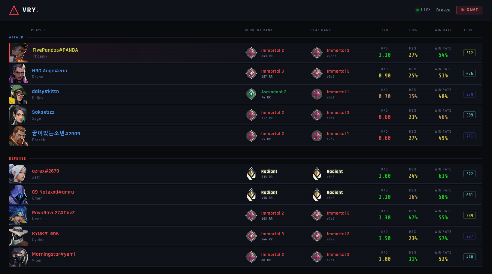
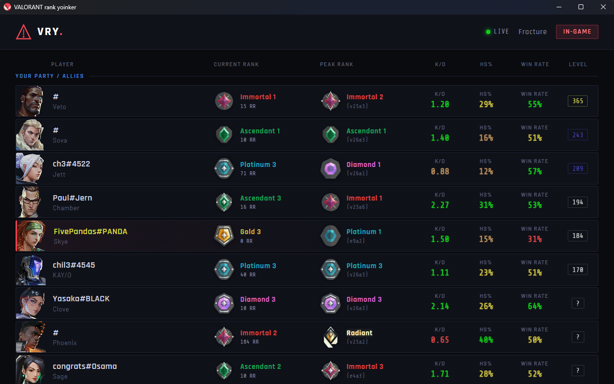

    
<h5 align="center"> VALORANT rank yoinker GUI</h5>

[![Downloads][downloads-shield]][downloads-url]

> [!NOTE]
> This is a personal/community fork of [VALORANT rank yoinker](https://github.com/isaacKenyon/valorant-rank-yoinker/) by isaacKenyon, adding a graphical user interface built with Microsoft Edge WebView2. The original project is in maintenance mode and won't receive any new updates.
>
> For issues specific to this fork, please [open a GitHub Issue](https://github.com/fivepandasna/VALORANT-rank-yoinker/issues).

---

  <ol>
    <li><a href="#about-the-project">About The Project</a></li>
    <li><a href="#prerequisites">Prerequisites</a></li>
    <li><a href="#usage">Usage</a></li>
    <li><a href="#contributing">Contributing</a></li>
    <li><a href="#acknowledgements">Acknowledgements</a></li>
    <li><a href="#disclaimer">Disclaimer</a></li>
  </ol>

## About The Project

VALORANT rank yoinker GUI is a fork of the original vRY that replaces the terminal with a full graphical interface powered by Microsoft Edge WebView2. All the same rank, skin, and account information is displayed, only now in a proper window.

## Prerequisites

- **Microsoft Edge WebView2 Runtime** — required for the GUI to function.
  - Already included on **Windows 11**.
  - **Windows 10** users can download it from [Microsoft's website](https://developer.microsoft.com/en-us/microsoft-edge/webview2/).
- **Microsoft Visual C++ Libraries** — download from [here](https://github.com/abbodi1406/vcredist/releases).

## Usage

### Bundled Release:

1) Install the [prerequisites](#prerequisites) above if needed.
2) Download the [latest release](https://github.com/fivepandasna/VALORANT-rank-yoinker/releases/latest).
3) Run vry-{version}-setup.exe and install
4) Run vry from your search bar or desktop

### Running from source:

1) Download Python [3.11](https://www.python.org/downloads/release/python-3119/) or [3.10](https://www.python.org/downloads/release/python-31011/), making sure it is added to PATH.
2) Download the [source](https://github.com/fivepandasna/archive/refs/heads/main.zip).
3) Run **`INSTALL.bat`** (or `pip install -r requirements.txt` in a terminal).

### Compiling from source:

1) `pip install cx_Freeze`
2) `python setup.py build`
3) Open the new Build folder and find `vRY.exe`.

### Letting GitHub Build It:

The latest tags to `main` are built automatically via [GitHub Actions](https://github.com/fivepandasna/actions). A successful build produces a compiled artifact you can download directly from the [Actions tab](https://github.com/fivepandasna/actions) — click the `Build` workflow, select a run, and grab the artifact.

To make and test your own changes:

1) [Fork](https://github.com/fivepandasna/fork) this repository.
2) Make your changes.
3) GitHub Actions will build `vRY.exe` for you. (Manually run)
4) Download and test it.
5) Open a Pull Request if you'd like your change merged.

## What about that Tweet?

The [Tweet](https://twitter.com/PlayVALORANT/status/1539728676815642624) outlines Riot's API policies. Applications are not allowed to expose data hidden by the game client. As of Version 1.262 of the original vRY, streamer mode is respected. This fork maintains that behaviour.

## Contributing

Contributions are **greatly appreciated**. Please open an issue first to discuss what you'd like to change.

## Acknowledgements

- [isaacKenyon](https://github.com/isaacKenyon) — original VALORANT rank yoinker
- [Valorant-API.com](https://valorant-api.com/)
- [Hamper](https://hamper.dev/)
- [D3CRYPT](https://d3crypt360.pages.dev/)

## Disclaimer

THIS PROJECT IS NOT ASSOCIATED OR ENDORSED BY RIOT GAMES. Riot Games, and all associated properties are trademarks or registered trademarks of Riot Games, Inc.

Whilst effort has been made to abide by Riot's API rules, you acknowledge that use of this software is done so at your own risk.

[downloads-shield]: https://img.shields.io/github/downloads/fivepandasna/VALORANT-rank-yoinker/total?style=for-the-badge&logo=github
[downloads-url]: https://github.com/fivepandasna/releases/latest